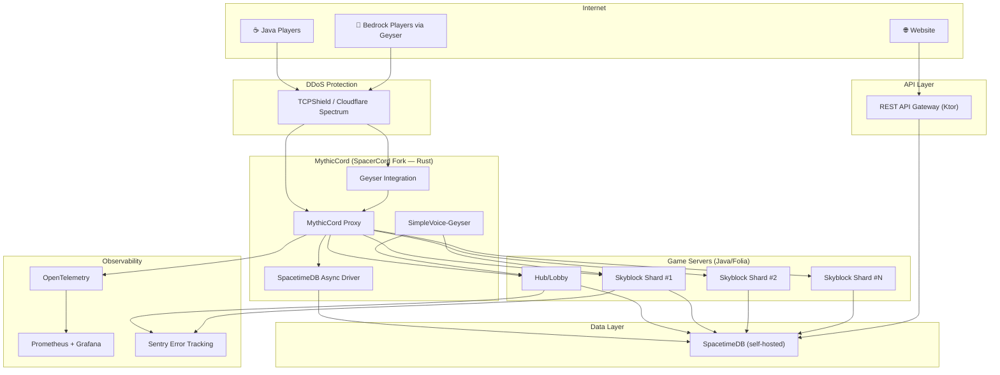
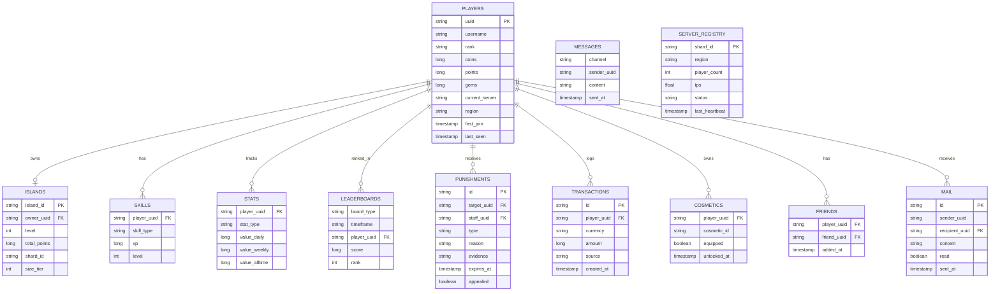

# 🏗️ MythicPvP — Grand Master Plan (v2)

> **Server Name:** &#FF00F8M&#FF20F9y&#FF40FAt&#FF60FBh&#FF80FCi&#FF9FFCc&#FFBFFDP&#FFDFFEv&#FFFFFFP
> **Colors:** Primary: Light Pink `#FF00F8` · Secondary: White `#FFFFFF` · Tertiary: Grey
> **Version:** 1.21.1 · **Server:** Folia · **Proxy:** MythicCord (SpacerCord fork)
> **Language:** Java 21 (server plugins), Rust (proxy) · **Build:** Maven
> **Database:** SpacetimeDB (sole database — no Redis) · **Bedrock:** Geyser + Voice Chat
> **Team:** 2 developers · **Store:** Tebex · **Hosting:** Multi-region bare metal/VPS
> **Anti-Cheat:** Custom solution (owner-provided, not in scope of this plan)

---

## 📐 High-Level Architecture



---

## 🎨 Branding & Hex System

Gradient identity: `&#FF00F8M&#FF20F9y&#FF40FAt&#FF60FBh&#FF80FCi&#FF9FFCc&#FFBFFDP&#FFDFFEv&#FFFFFFP`

The **HexAPI** parses `&#RRGGBB` tags across all text surfaces. The custom **MythicPvP font** (via resource pack) is used in scoreboards, tab, menus, and nametags for a premium branded look.

---

## 🔧 Tech Stack

| Layer | Technology | Role |
|-------|-----------|------|
| **DDoS** | TCPShield / Cloudflare Spectrum | L4 proxy protection |
| **Proxy** | MythicCord (SpacerCord/Infrarust fork, Rust) | Routing, SpacetimeDB, Geyser |
| **Game Server** | Folia 1.21.1 (Java 21) | Regionized multithreaded MC |
| **Server Plugins** | Java 21 + Maven multi-module | All gameplay logic |
| **Database** | SpacetimeDB (self-hosted, sole DB) | Persistence, real-time sync, pub/sub |
| **Bedrock** | Geyser (integrated in proxy) | Bedrock→Java translation |
| **Voice** | SimpleVoice-Geyser | Proximity voice chat |
| **Resource Pack** | Existing SMP Deluxe base (`smpd` namespace) | Custom textures, models, fonts |
| **Web API** | Ktor | REST gateway with JWT + rate limiting |
| **Website** | Next.js + SpacetimeDB TS SDK | Real-time frontend |
| **Store** | Tebex (webhook → REST gateway) | Cosmetic-only purchases (EULA compliant) |
| **CI/CD** | GitHub Actions | Build → test → package → deploy |
| **Monitoring** | OpenTelemetry + Prometheus + Grafana | Metrics, traces, dashboards |
| **Errors** | Sentry | Runtime error tracking |
| **Containers** | Docker Compose | One-command network spin-up |

---

## 📦 Repository Structure

```
mythicpvp/
├── pom.xml                              # Parent Maven POM
│
├── mythic-suite/                        # ══ THE FOUNDATION SUITE (23 modules) ══
│   ├── suite-api/                       # Core interfaces & contracts
│   ├── suite-packet/                    # Internal packet abstraction
│   ├── suite-hex/                       # HexAPI — hex color parsing
│   ├── suite-command/                   # CommandAPI — Aikar ACF-style + command blocker
│   ├── suite-tab/                       # TabAPI — per-player tab list
│   ├── suite-scoreboard/               # ScoreboardAPI — per-player boards
│   ├── suite-nametag/                   # NametagAPI — rank prefixes, hex
│   ├── suite-menu/                      # MenuAPI — chest GUI builder
│   ├── suite-hologram/                  # HologramAPI — floating displays
│   ├── suite-skin/                      # SkinAPI — skin fetching/caching
│   ├── suite-config/                    # ConfigAPI — YAML hot-reload + all text/message surfaces
│   ├── suite-database/                  # DatabaseAPI — SpacetimeDB Java client
│   ├── suite-protocol/                  # ProtocolAPI — cross-server messaging
│   ├── suite-scheduler/                 # SchedulerAPI — Folia-safe scheduling
│   ├── suite-economy/                   # EconomyAPI — multi-currency
│   ├── suite-permission/               # PermissionAPI — rank-based perms
│   ├── suite-item/                      # ItemAPI — item builder with hex lore
│   ├── suite-cooldown/                  # CooldownAPI — universal cooldowns
│   ├── suite-event/                     # EventAPI — custom event bus
│   ├── suite-chat/                      # ChatAPI — channels, filtering, hex
│   ├── suite-format/                    # FormatAPI — money/time/duration formatting
│   ├── suite-resourcepack/             # ResourcePackAPI — custom textures/fonts
│   ├── suite-cosmetic/                  # CosmeticAPI — hats, titles, particles
│   └── suite-disguise/                  # DisguiseAPI — skin/name/tab spoofing
│
├── mythic-core/                         # Core plugin (friends, party, mail, punish)
├── mythic-hub/                          # Hub/Lobby plugin
├── mythic-skyblock/                     # Skyblock gamemode
│   ├── skyblock-api/
│   ├── skyblock-islands/
│   ├── skyblock-pvp/
│   ├── skyblock-skills/
│   ├── skyblock-economy/
│   └── skyblock-events/
│
├── mythic-cord/                         # MythicCord (SpacerCord fork, Rust)
├── api-suite/                           # External REST APIs (Ktor)
├── web/                                 # Next.js website
├── TexturePack/                         # Resource pack (SMP Deluxe base + custom)
│
├── tools/
│   ├── docker/
│   │   ├── docker-compose.yml           # Full network: proxy + shards + STDB
│   │   ├── docker-compose.dev.yml       # Dev: single shard + STDB
│   │   ├── Dockerfile.folia             # Folia server image
│   │   ├── Dockerfile.mythiccord        # MythicCord proxy image
│   │   └── Dockerfile.api              # API gateway image
│   ├── monitoring/                      # Prometheus + Grafana configs
│   └── scripts/                         # Deploy automation
│
└── docs/
```

---

## 🏛️ THE MYTHIC SUITE — Foundation (23 Modules)

> **The suite must be complete before any gameplay code.** Every future gamemode builds on these APIs.

### Modules 1–23

| # | Module | Purpose | Status |
|---|--------|---------|--------|
| 1 | `suite-api` | Core interfaces, ServiceRegistry, Currency, MythicPlayer | ✅ Done |
| 2 | `suite-packet` | Internal packet action/session abstraction for display and disguise modules | ✅ Done |
| 3 | `suite-hex` | `&#RRGGBB` parsing, gradients, MiniMessage integration, custom fonts | ✅ Done |
| 4 | `suite-command` | Aikar-style annotations, permission-hidden tab-complete, command blocker config | ✅ Done |
| 5 | `suite-tab` | Per-player tab with hex, rank sorting, custom font support | ✅ Done |
| 6 | `suite-scoreboard` | Packet-based per-player boards, animated titles, custom font | ✅ Done |
| 7 | `suite-nametag` | Packet-level nametags with hex prefix/suffix, glow colors | ✅ Done |
| 8 | `suite-menu` | Chest GUI builder, pagination, click cooldowns | ✅ Done |
| 9 | `suite-hologram` | Packet holograms, per-player, animated, leaderboard type | ✅ Done |
| 10 | `suite-skin` | Mojang fetch + cache, NPC skins, head textures | ✅ Done |
| 11 | `suite-config` | YAML config wrapper, hot-reload, multi-file manager, configurable text surfaces | ✅ Done |
| 12 | `suite-format` | Money shorthand (1K/1M/1.5B/1T), duration, time ago, date/time | ✅ Done |
| 13 | `suite-database` | SpacetimeDB Java WS client, subscriptions, reducers | ✅ Done |
| 14 | `suite-protocol` | Cross-server messaging via pub/sub | ✅ Done |
| 15 | `suite-scheduler` | Folia RegionScheduler/EntityScheduler abstraction | ✅ Done |
| 16 | `suite-economy` | Coins/Points/Gems, multi-currency management | ✅ Done |
| 17 | `suite-permission` | Ranks with hex colors, inheritance, wildcards | ✅ Done |
| 18 | `suite-item` | Fluent builder, hex lore, custom model data, PDC helpers | ✅ Done |
| 19 | `suite-cooldown` | Named cooldowns, per-player, thread-safe | ✅ Done |
| 20 | `suite-event` | Custom event bus, priorities, cancellation | ✅ Done |
| 21 | `suite-chat` | Channels, hex formatting, spam/ad/toxicity filter | ✅ Done |
| 22 | `suite-resourcepack` | Custom model/font registry, pack URL management | ✅ Done |
| 23 | `suite-cosmetic` | Hats, titles, particles, ownership/equip system | ✅ Done |
| — | `suite-disguise` | Skin/name/rank override state management and integrations | ✅ Done |

### ConfigAPI Text Contract

Every player-facing message and display surface must be configurable through YAML. This includes chat formats, chat prefixes, scoreboard titles and lines, tab headers/footers, nametags, hologram lines, menu labels, resource-pack prompts, cooldown/economy/permission feedback, command responses, disguise text, and any future gameplay messages. Modules should resolve text through `ConfigText` or a module-specific YAML wrapper and provide sensible defaults that are written when keys are missing.

### Command Visibility Contract

Players must only be able to run, see, or tab-complete commands they have permission to use. `suite-command` filters registered command aliases, subcommands, root `/` tab-completion, and command list packets by permission before the client can discover them. It also owns `command-blocker.yml`, which can explicitly block or permission-gate commands such as `/pl`, `/plugins`, `/bukkit:pl`, `/?`, `/bukkit:?`, `/help`, and version aliases. Blocked commands return the configurable blocked message and are removed from tab-complete unless the sender has the configured command permission or bypass permission.

### NEW Module 19: `suite-format` — FormatAPI

Universal number/time/date formatting used by economy, scoreboards, chat, and all display modules.

- **Money shorthand:** `1000` → `1K`, `1500000` → `1.5M`, `1000000000` → `1B`, `1900000000000` → `1.9T`
- **Full commas:** `1,500,000` for detailed views
- **Duration:** `3d 2h 15m 30s`, compact `02:15:30`, words `3 days 2 hours`
- **Time ago:** `5m ago`, `3h ago`, `2d ago`
- **Date/Time:** `MM/dd/yyyy`, `MM/dd/yyyy HH:mm`, `HH:mm:ss`
- **Time parsing:** `"30m"` → 1800000ms, `"2d"` → 172800000ms
- **Percent:** `0.75` → `75%`
  ```java
  MythicFormat.money(1500000);    // "$1.5M"
  MythicFormat.number(2500000000L); // "2.5B"
  MythicFormat.duration(90061000); // "1d 1h 1m 1s"
  MythicFormat.timeAgo(timestamp); // "3h ago"
  MythicFormat.parseTime("30m");   // 1800000
  ```

### NEW Module 20: `suite-resourcepack` — ResourcePackAPI

Manages the custom texture pack (based on existing `TexturePack/` with `smpd` namespace).

- **Pack serving:** Host pack via HTTP, auto-send to players on join
- **Bedrock conversion:** Auto-convert Java pack for Geyser/Bedrock clients
- **Custom model data registry:** Map items to custom textures programmatically
  ```java
  ResourcePack.register("mythic_sword", Material.DIAMOND_SWORD, 10001);
  // ItemAPI integration: MythicItem.create(Material.DIAMOND_SWORD).model("mythic_sword")
  ```
- **Custom font registry:** Register bitmap/TTF fonts for scoreboard, tab, menus
  ```java
  MythicFont.register("mythic_title", "smpd:font/mythic_title");
  // Use in HexAPI: MythicHex.font("mythic_title", "&#FF00F8MythicPvP")
  ```
- **Pack versioning:** Hash-based, force re-download on update
- **Hot-swap textures:** Update textures without server restart (re-send pack)

### NEW Module 20: `suite-cosmetic` — CosmeticAPI

Cosmetic system powered by resource pack custom models. **EULA compliant** — cosmetic only, no gameplay advantage.

- **Cosmetic types:**
  - **Hats** — Custom head models via resource pack (equipped via helmet slot with custom model data)
  - **Titles** — Text tags above/below nametag (e.g., "⚔ Champion", "🌟 Mythic")
  - **Particles** — Persistent particle trails (walk, idle, attack)
  - **Kill Effects** — Visual/sound on player kill
  - **Win Effects** — Visual on KOTH/event win
  - **Chat Tags** — Cosmetic prefixes/icons in chat
- **Unlock system:** Tebex purchases, achievement rewards, event prizes
- **Equip GUI:** `/cosmetics` menu via MenuAPI
- **Preview system:** Try-before-buy particle/hat preview
- **SpacetimeDB persistence:** Owned cosmetics + equipped loadout per player

### NEW Module 21: `suite-disguise` — DisguiseAPI

Full player disguise system. Uses the **same internal packet layer** as `suite-nametag` and `suite-tab` — **no external PacketEvents dependency required**. Our suite builds a lightweight NMS packet abstraction internally.

- **Disguise capabilities:**
  - Change displayed skin (GameProfile spoofing via PlayerInfo packets)
  - Change displayed username (nametag + tab + chat)
  - Change rank appearance (prefix/suffix override)
  - Full "nick" mode: random name + default skin
- **Implementation:** Intercepts outgoing `ClientboundPlayerInfoUpdatePacket` and `ClientboundAddEntityPacket` via our internal packet layer. Respawns the player entity for observers to apply skin changes.
- **Staff features:**
  - `/disguise <name>` — disguise as specific player
  - `/disguise random` — random nick
  - `/undisguise` — revert
  - Staff can see through disguises (visible in tab hover)
- **Integration:** Works with NametagAPI, TabAPI, ChatAPI — all respect disguise state
- **Folia-safe:** All packet operations scheduled on the correct region thread

---

## 🔒 Security & Proxy Hardening

### Network Protection
- **TCPShield** in front of MythicCord for L4 DDoS mitigation
- **MythicCord Rust-native rate limiting:** Login throttle, connection flood protection
- **Bot filtering:** Handshake validation, join velocity checks
- **VPN/proxy detection:** IP intelligence API integration in MythicCord

### Backend Protection
- All Folia backends run `online-mode=false`
- MythicCord forwards player UUID + IP (Velocity-style `modern` forwarding)
- Backend plugin validates forwarded identity via shared secret
- Direct backend connections rejected (firewall + secret check)

### API Security
- JWT tokens for website sessions (short-lived + refresh tokens)
- API key management for external consumers
- Rate limiting per endpoint (token bucket)
- CORS whitelist for web origins
- Secrets managed via environment variables (never in config files)

### EULA Compliance
- **Store (Tebex) sells cosmetic-only items:** hats, titles, particles, chat tags
- **No gameplay-affecting purchases:** No P2W ranks, no enchant boosts, no point multipliers
- Ranks are earned through gameplay; cosmetics are purchasable

---

## 💾 Reliability, Backups & Disaster Recovery

### SpacetimeDB Backups
- **Automated snapshots:** Every 6 hours via cron + SpacetimeDB CLI export
- **Continuous commit log:** SpacetimeDB's built-in WAL provides point-in-time recovery
- **Off-site backup:** Snapshots synced to separate storage (S3-compatible)
- **Failover testing:** Monthly DR drill — restore from backup to staging

### Island Backups
- **Auto-snapshot:** Island schematic saved on every significant modification
- **Versioned history:** Last 5 snapshots retained per island in SpacetimeDB blobs
- **Player-triggered:** `/is backup` (cooldown-gated) for manual save

### Economy Rollback
- **Transaction log:** Every economy mutation logged with timestamp, source, amount
- **Rollback reducer:** SpacetimeDB reducer to revert transactions by time range or player
- **Dupe detection:** Anomaly detection on balance changes (flag >2σ deviations)

### Monitoring & Alerting
- **MythicCord:** OpenTelemetry traces + metrics (built into Infrarust)
- **Folia servers:** TPS, region count, entity count → `server_registry` SpacetimeDB table
- **Dashboards:** Grafana with panels for player count, TPS per shard, DB latency, error rates
- **Alerts:** Prometheus alerting → Discord webhook for TPS < 18, shard disconnect, DB latency > 50ms
- **Error tracking:** Sentry SDK in all Java plugins for runtime exception capture

---

## ⚡ Performance & Scaling

### Multi-Region Hosting
- **Proxy layer:** MythicCord instances per region (US, EU) behind geo-DNS
- **Game servers:** Shards co-located with proxy in each region
- **SpacetimeDB:** Primary instance in main region, read replicas if needed
- **Player routing:** MythicCord routes to lowest-latency shard matching player's region

### Shard Assignment
- MythicCord `player_routing` reducer considers: shard load, player's island location, party members, region proximity
- **Fallback:** If target shard is full/unhealthy, route to next-best shard
- **Health checks:** `server_registry` table with heartbeat, TPS, player count per shard

### Folia Optimization
- Pre-generate all worlds (void skyblock + PvP zone terrain)
- Aggressive entity limits per island region
- View distance tuning per shard type (Hub: 8, Skyblock: 6, PvP: 10)
- Packet compression enabled, chunk batching
- Suite scheduler abstraction tested heavily against Folia edge cases

### Load Testing
- Early load tests in Phase 1 (SpacetimeDB throughput) and Phase 2 (proxy connections)
- Bot framework for simulating 500+ concurrent players
- Profiling SpacetimeDB memory usage under sustained load

---

## 🐳 Docker Compose — One-Command Network

`tools/docker/docker-compose.yml` spins up the entire network:

```yaml
# Simplified structure — full version in repo
services:
  spacetimedb:
    image: clockworklabs/spacetimedb
    ports: ["3000:3000"]
    volumes: [stdb-data:/stdb]

  mythiccord:
    build: ./Dockerfile.mythiccord
    ports: ["25565:25565", "8080:8080"]
    depends_on: [spacetimedb]
    environment:
      STDB_URI: "http://spacetimedb:3000"

  hub:
    build: ./Dockerfile.folia
    environment:
      SERVER_TYPE: hub
      STDB_URI: "http://spacetimedb:3000"
    depends_on: [spacetimedb, mythiccord]

  skyblock-1:
    build: ./Dockerfile.folia
    environment:
      SERVER_TYPE: skyblock
      SHARD_ID: "1"
      STDB_URI: "http://spacetimedb:3000"
    depends_on: [spacetimedb, mythiccord]

  prometheus:
    image: prom/prometheus
    volumes: [./monitoring/prometheus.yml:/etc/prometheus/prometheus.yml]

  grafana:
    image: grafana/grafana
    ports: ["3001:3000"]
    depends_on: [prometheus]

volumes:
  stdb-data:
```

`docker-compose.dev.yml` — lightweight dev variant (single shard, no monitoring).

---

## 👥 Social Features (in `mythic-core`)

### Friends System
- `/friend add/remove/list` — cross-shard via SpacetimeDB
- Online notifications on login
- Jump-to-friend server (`/friend tp <name>`)

### Party System
- `/party create/invite/disband/chat`
- Co-transfer: entire party moves to same shard
- Party-wide island access

### Mail & Offline Rewards
- `/mail send <player> <message>` — delivered on next login
- Offline reward accumulation (daily login streaks, idle crop growth)

---

## 🗄️ SpacetimeDB Schema



---

## ⚠️ SpacetimeDB Risk Mitigations

| Risk | Mitigation |
|------|-----------|
| **Java client maturity** | `suite-database` is critical path — 2 weeks dedicated. Test reconnection, subscription scaling with 500+ concurrent players, reducer latency. |
| **Schema evolution** | Reducer-based migrations. Version field in schema. Test upgrades on staging before prod. |
| **RAM limits** | Profile memory under load. Purge old `MESSAGES`/`TRANSACTIONS` rows periodically. Archive cold data. |
| **Single point of failure** | Automated backups every 6hr. Fast restore tested monthly. Future: explore SpacetimeDB replication. |

---

## 🗓️ Development Phases (2-person team)

### Phase 1 — Mythic Suite (Weeks 1–8) ✅ COMPLETE

> **All 26 reactor modules compile and test — BUILD SUCCESS.**

| Week | Dev A | Dev B | Status |
|------|-------|-------|--------|
| 1–2 | `suite-database` (CRITICAL PATH) | `suite-hex`, `suite-config`, `suite-format` | ✅ |
| 2–3 | `suite-database` (continued), `suite-scheduler` | `suite-item`, `suite-menu` | ✅ |
| 3–4 | `suite-command` + command blocker, `suite-event`, `suite-packet` | `suite-tab`, `suite-scoreboard` | ✅ |
| 4–5 | `suite-economy`, `suite-permission` | `suite-nametag`, `suite-hologram` | ✅ |
| 5–6 | `suite-protocol`, `suite-cooldown` | `suite-resourcepack`, `suite-skin` | ✅ |
| 6–7 | `suite-chat` (incl. filtering) | `suite-cosmetic` | ✅ |
| 7–8 | `suite-disguise`, integration tests | Full suite integration tests | ✅ |

---

### Phase 2 — MythicCord + Geyser + Docker (Weeks 9–12)

| Task | Owner | Status |
|------|-------|--------|
| **Fork from Infrarust** (not SpacerCord — clean rebase, refactored as `mythic-cord/`) | Dev A | ✅ |
| SpacetimeDB module: sessions, routing, punishments, registry, economy, social, gameplay | Dev A | ✅ |
| Java mirror in `suite-database/schema/` (constants, DTOs, typed reducer client, version check) | Dev A | ✅ |
| MythicCord workspace: `stdb-bridge`, `plugin-routing`, `proxy` crates | Dev A | ✅ |
| Pterodactyl egg JSON + management surface (admin HTTP, SIGTERM drain, JSON logs) | Dev A | ✅ |
| Docker Compose: full network + dev variant (STDB, proxy, Folia, API, monitoring) | Dev A | ✅ |
| `stdb-publish` container — auto-publishes WASM module on `compose up` | Dev A | ✅ |
| Monitoring stack: Prometheus + Grafana provisioning, starter dashboard | Dev B | ✅ |
| Vendor `infrarust/` subtree via `mythic-cord/tools/vendor-infrarust.{sh,ps1}` | Dev A | ⏳ pending bootstrap |
| Geyser integration + Bedrock resource pack conversion | Dev B | ✅ |
| SimpleVoice-Geyser deployment + proximity config | Dev B | ✅ |
| Sentry integration in Java suite | Dev B | ✅ |

#### Deliverables landed

| Module | Path | Notes |
|---|---|---|
| **STDB schema** | [`mythic-cord/stdb/`](mythic-cord/stdb/) | 9 modules, 24 tables, 31 reducers, `SCHEMA_VERSION=1` |
| **Java mirror** | [`mythic-suite/suite-database/schema/`](mythic-suite/suite-database/src/main/java/net/mythicpvp/suite/database/schema/) | 28 files (5 enums, 18 DTO records, `MythicSchema` typed client, `SchemaVersion` boot check) — **17 new tests, all green** |
| **Rust bridge** | [`mythic-cord/stdb-bridge/`](mythic-cord/stdb-bridge/) | Driver thread + `StdbHandle` + `MythicStdbClient` (typed reducer wrappers) |
| **Routing plugin** | [`mythic-cord/plugin-routing/`](mythic-cord/plugin-routing/) | `pick_shard` (mirrors STDB pure fn), `RegistryView`, heartbeat task, Infrarust event hooks (gated by `with-infrarust` feature) |
| **Proxy binary** | [`mythic-cord/proxy/`](mythic-cord/proxy/) | Standalone build today (registry citizen + admin HTTP); flips to full proxy after vendor script runs |
| **Pterodactyl egg** | [`mythic-cord/pterodactyl/egg-mythiccord.json`](mythic-cord/pterodactyl/egg-mythiccord.json) | 11 env variables, install script downloads musl release, default config seeded on first install |
| **Docker scaffold** | [`tools/docker/`](tools/docker/) | `docker-compose{,dev}.yml`, 5 Dockerfiles, monitoring + provisioning, up/down scripts |
| **Geyser deployment** | [`tools/docker/geyser/`](tools/docker/geyser/) | Standalone Bedrock sidecar on UDP `19132`, runtime-rendered Geyser target defaults to Hub and switches to MythicCord when traffic support is enabled, Bedrock pack mount at `geyser/packs/`, process-backed `.mcpack` conversion hook |
| **Voice deployment** | [`tools/docker/folia/voicechat-server.properties`](tools/docker/folia/voicechat-server.properties) | Simple Voice Chat + SimpleVoice-Geyser Modrinth resolution baked into Folia image, proximity defaults, UDP/web bridge ports |
| **Sentry bootstrap** | [`MythicErrorTracker`](mythic-suite/suite-api/src/main/java/net/mythicpvp/suite/api/error/MythicErrorTracker.java) | Shared Java suite Sentry initializer with Docker env wiring and shaded SDK runtime |

#### Design decisions

- **Forked Infrarust directly, not SpacerCord.** SpacerCord stays a reference — its driver-thread / clone-able-handle pattern is cherry-picked into [`stdb-bridge`](mythic-cord/stdb-bridge/), not its `module_bindings/` (which would conflict with our schema).
- **AGPL-3.0** carries from Infrarust. The proxy stack is AGPL-3.0-or-later with the upstream plugin exception preserved (closed-source plugins still permitted). The Java suite under `mythic-suite/` is licensed separately at the repo root.
- **Two operating modes via one cargo feature** (`with-infrarust`). Default standalone build works today (no Infrarust subtree needed). Full proxy is one `--features with-infrarust` away after the vendor script runs. Means the workspace stays buildable through the rebase process instead of being broken-by-design.
- **Schema versioning is a strict gate.** `SCHEMA_VERSION` is asserted on both the Java side (`SchemaVersion.assertMatches`) and the Rust side (`assert_schema_version`) at boot. Mismatched suite vs STDB module refuses to start.
- **`pick_shard` lives twice** — once in [`mythic-stdb`](mythic-cord/stdb/src/sessions.rs) for cross-shard transfers, once in [`plugin-routing`](mythic-cord/plugin-routing/src/router.rs) for the proxy hot path. Identical formula, both unit-tested, no network round-trip per login.
- **Pterodactyl integration is real**, not a placeholder. SIGTERM/SIGINT triggers drain → status flip → 500ms grace → final offline heartbeat → exit 0. Admin HTTP exposes `/health`, `/metrics`, `POST /admin/drain` for manual rolling deploys.

#### Verification (last run)

| Surface | Tool | Result |
|---|---|---|
| Full Maven reactor | `mvn -B -ntp test` | **BUILD SUCCESS** — all 26 modules, ~38 tests pass |
| Docker Compose syntax | `docker compose -f tools/docker/docker-compose.yml config --quiet` | Clean after Geyser, voice, Sentry wiring |
| Docker Compose dev syntax | `docker compose -f tools/docker/docker-compose.dev.yml config --quiet` | Clean after voice and Sentry wiring |
| `suite-database` schema package | `mvn -pl mythic-suite/suite-database test` | **20/20 green** (`MythicSchemaTest` 12, `DtoRoundTripTest` 5, `SpacetimeConnectionTest` 3) |
| `mythic-stdb` (SpacetimeDB module) | `cargo check -p mythic-stdb --target wasm32-unknown-unknown` | Clean — 0 errors, 0 warnings |
| `mythiccord-stdb-bridge` | `cargo test -p mythiccord-stdb-bridge` | **2/2 green** (`enum_wire_values`, `registry_announce_args_shape`) |
| `mythiccord-plugin-routing` | `cargo test -p mythiccord-plugin-routing` | **4/4 green** (3× `router::*` + `registry_view::insert_then_update_then_delete`) |
| `mythiccord` (proxy binary, standalone) | `cargo check -p mythiccord` | Clean — 0 errors, 0 warnings |

Toolchain: Maven 3.9.9 + Microsoft OpenJDK 21.0.11 for Java; Rust 1.94.1 (`x86_64-pc-windows-gnu`) + winlibs MinGW-w64 14.2.0 for Rust. All toolchains installed under `.build-tools/` (gitignored) so the host environment stays clean.

---

### Phase 3 — Core Plugin + Hub (Weeks 13–16)

| Task | Owner |
|------|-------|
| `mythic-core`: bootstrap, sessions, ranks, nametags, tab, scoreboard | Dev A |
| `mythic-core`: punishments (temp/perma/appeal), staff commands, audit log | Dev A |
| `mythic-core`: friends, party, mail, offline rewards | Dev B |
| `mythic-hub`: spawn, server selector, cosmetic preview, hub activities | Dev B |
| Resource pack: finalize MythicPvP custom font, rebrand `smpd` → `mythic` namespace | Dev B |
| Tebex webhook integration → cosmetic unlock pipeline | Dev A |

---

### Phase 4 — Skyblock Core (Weeks 17–24)

- Island management, sharding, Slime-format storage
- Economy, shops, auction house
- Custom enchantments (Common → Mythic)
- Quests, milestones, progression tracks

---

### Phase 5 — PvP & Events (Weeks 25–30)

- PvP zones, combat tag, kill rewards, killstreaks
- KOTH system (4hr schedule, capture points, buffs)
- Airdrop system (player-threshold triggers, tiered loot)
- Points system (PvP weighted highest), Island Top

---

### Phase 6 — Skills & Leaderboards (Weeks 31–36)

- Mining, Farming, Fishing, Combat — XP curves, abilities
- Leaderboards: Daily/Weekly/Monthly/All-time per category
- In-game hologram displays + `/leaderboard` GUI
- Automated payouts per timeframe

---

### Phase 7 — API Suite & Website (Weeks 37–42)

- REST gateway (Ktor): JWT auth, rate limiting, Swagger docs
- Skin/nametag rendering API, leaderboard API, forum API
- Next.js website: Home, Leaderboards, Profiles, Forums, Clan, Store, Staff Panel
- MC account linking, real-time updates via SpacetimeDB TS SDK

---

## 📊 Phase Summary

| Phase | Name | Weeks | Key Deliverables |
|-------|------|-------|-----------------|
| **1** | **Mythic Suite** ⭐ | 1–8 | All 23 foundation APIs, YAML-configurable text surfaces, tested and documented |
| **2** | **MythicCord + Docker** 🚧 | 9–12 | STDB schema ✅ (wasm32 build clean), Java mirror ✅ (20/20 tests), Rust bridge ✅ (2/2 tests), routing plugin ✅ (4/4 tests), standalone proxy ✅ (cargo check clean), Pterodactyl egg ✅, Docker scaffold + monitoring ✅, Geyser sidecar ✅, voice deployment ✅, Sentry bootstrap ✅. Infrarust subtree vendored on first bootstrap |
| **3** | Core + Hub | 13–16 | Base plugin, friends/party, hub, Tebex, resource pack |
| **4** | Skyblock Core | 17–24 | Islands, economy, enchants, quests |
| **5** | PvP & Events | 25–30 | PvP zones, KOTH, airdrops, points |
| **6** | Skills & Leaderboards | 31–36 | 4 skills, leaderboard system |
| **7** | API + Website | 37–42 | REST APIs, Next.js website, forums |
