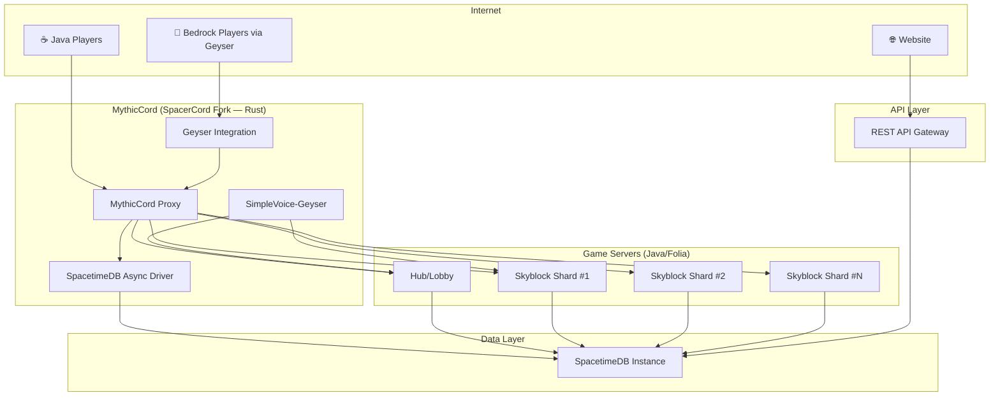
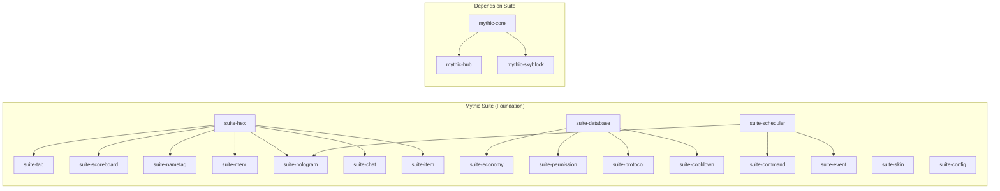
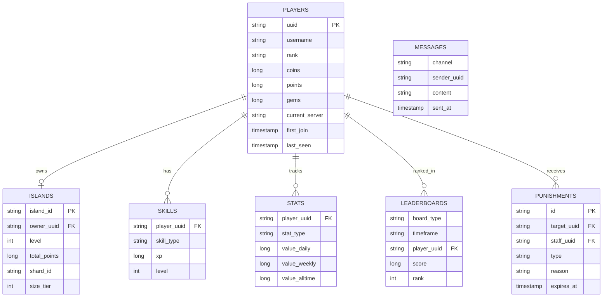

# 🏗️ MythicPvP — Grand Master Plan

> **Server Name:** &#FF00F8M&#FF20F9y&#FF40FAt&#FF60FBh&#FF80FCi&#FF9FFCc&#FFBFFDP&#FFDFFEv&#FFFFFFP
> **Colors:** Primary: Light Pink `#FF00F8` · Secondary: White `#FFFFFF` · Tertiary: Grey
> **Version:** 1.21.1 · **Server:** Folia · **Proxy:** MythicCord (SpacerCord fork)
> **Language:** Java (server plugins), Rust (proxy) · **Build:** Maven
> **Database:** SpacetimeDB (sole database — no Redis) · **Bedrock:** Geyser + Voice Chat

---

## 📐 High-Level Architecture



---

## 🎨 Branding & Hex System

The server's gradient identity: `&#FF00F8M&#FF20F9y&#FF40FAt&#FF60FBh&#FF80FCi&#FF9FFCc&#FFBFFDP&#FFDFFEv&#FFFFFFP`

The **HexAPI** in the suite will parse `&#RRGGBB` tags and apply them across all text surfaces — chat, tab, scoreboard, nametags, holograms, item lore, and GUIs.

---

## 🔧 Tech Stack Summary

| Layer | Technology | Role |
|-------|-----------|------|
| **Proxy** | MythicCord (SpacerCord/Infrarust fork, Rust) | Routing, SpacetimeDB bridge, Geyser |
| **Game Server** | Folia 1.21.1 (Java) | Regionized multithreaded MC server |
| **Server Plugins** | Java 21 + Maven multi-module | All gameplay logic |
| **Database** | SpacetimeDB (sole DB) | All persistence, real-time sync, pub/sub |
| **Bedrock** | Geyser (integrated in proxy) | Bedrock→Java translation |
| **Voice** | SimpleVoice-Geyser | Proximity voice for all players |
| **Web API** | Ktor or SpacetimeDB HTTP API | REST endpoints for website |
| **Website** | Next.js + SpacetimeDB TS SDK | Real-time frontend |

> [!IMPORTANT]
> **SpacetimeDB replaces Redis entirely.** Its in-memory state + real-time subscriptions handle both caching and pub/sub. The proxy communicates via the bundled Rust SDK, and game servers use a custom Java WebSocket client (built in Phase 1).

---

## 📦 Repository Structure

```
mythicpvp/
├── pom.xml                              # Parent Maven POM
│
├── mythic-suite/                        # ══ THE FOUNDATION SUITE ══
│   ├── suite-api/                       # Core interfaces & contracts
│   ├── suite-hex/                       # HexAPI — hex color parsing everywhere
│   ├── suite-command/                   # CommandAPI — Aikar ACF-style annotations
│   ├── suite-tab/                       # TabAPI — per-player tab list control
│   ├── suite-scoreboard/               # ScoreboardAPI — per-player scoreboards
│   ├── suite-nametag/                   # NametagAPI — rank prefixes, hex colors
│   ├── suite-menu/                      # MenuAPI — chest GUI builder
│   ├── suite-hologram/                  # HologramAPI — floating text displays
│   ├── suite-skin/                      # SkinAPI — skin fetching, caching, rendering
│   ├── suite-config/                    # ConfigAPI — YAML config with hot-reload
│   ├── suite-database/                  # DatabaseAPI — SpacetimeDB Java client
│   ├── suite-protocol/                  # ProtocolAPI — cross-server messaging
│   ├── suite-scheduler/                 # SchedulerAPI — Folia-safe task scheduling
│   ├── suite-economy/                   # EconomyAPI — multi-currency system
│   ├── suite-permission/               # PermissionAPI — rank-based permissions
│   ├── suite-item/                      # ItemAPI — item builder with hex lore
│   ├── suite-cooldown/                  # CooldownAPI — universal cooldown manager
│   ├── suite-event/                     # EventAPI — custom event bus
│   └── suite-chat/                      # ChatAPI — formatted chat with hex
│
├── mythic-core/                         # Core server plugin (depends on suite)
│
├── mythic-hub/                          # Hub/Lobby server plugin
│
├── mythic-skyblock/                     # Skyblock gamemode plugin
│   ├── skyblock-api/
│   ├── skyblock-islands/
│   ├── skyblock-pvp/
│   ├── skyblock-skills/
│   ├── skyblock-economy/
│   └── skyblock-events/
│
├── mythic-cord/                         # MythicCord (SpacerCord fork, Rust)
│
├── api-suite/                           # External REST API services
│
├── web/                                 # Next.js website
│
├── tools/                               # Docker, load-test, scripts
│   └── docker/
│
└── docs/
```

---

## 🏛️ THE MYTHIC SUITE — Foundation API Deep Dive

> [!IMPORTANT]
> **The suite is the bedrock of everything.** No gameplay code is written until every suite module is complete, tested, and documented. Every future gamemode (Skyblock, Prison, Factions) is built entirely on top of these APIs.

### Suite Module Catalog

#### 1. `suite-hex` — HexAPI
Parses `&#RRGGBB` tags into Adventure/MiniMessage components. Used by every other module.
- `MythicHex.colorize(String)` → `Component`
- Gradient builder: `MythicHex.gradient("#FF00F8", "#FFFFFF", "MythicPvP")`
- Legacy `&` code support alongside hex
- Placeholder integration (`%player%`, `%rank%`, etc.)

#### 2. `suite-command` — CommandAPI (Aikar-style)
Annotation-driven commands. No `plugin.yml` registration. Auto tab-complete.
```java
@CommandAlias("spawn|hub")
@CommandPermission("mythic.command.spawn")
public class SpawnCommand extends MythicCommand {

    @Default
    @Description("Teleport to spawn")
    public void onSpawn(MythicPlayer player) {
        player.teleportToSpawn();
    }

    @Subcommand("set")
    @CommandPermission("mythic.admin.setspawn")
    public void onSetSpawn(MythicPlayer player, @Optional String name) {
        // ...
    }
}
```
- Custom context resolvers: `MythicPlayer`, `Island`, `Skill`, etc.
- Automatic validation + hex-colored error messages
- Cooldown integration via `@Cooldown` annotation
- Platform-agnostic core (works on Folia backend + proxy)

#### 3. `suite-tab` — TabAPI
Per-player tab list with hex support, sorting, and dynamic updates.
- Set header/footer with hex gradients
- Per-player tab entries (fake players, rank sorting)
- Priority-based sorting (Staff → VIP → Default)
- Update intervals configurable per section
- Placeholder support in all fields

#### 4. `suite-scoreboard` — ScoreboardAPI
Per-player packet-based scoreboards (no flickering).
- `MythicBoard` builder with hex title and lines
- Animated title support (cycling gradients)
- Per-line update (only sends changed lines)
- Conditional lines (show/hide based on context)
- Multiple board profiles (lobby board, game board, etc.)

#### 5. `suite-nametag` — NametagAPI
Packet-level nametag manipulation with hex prefix/suffix.
- Rank-based prefix: `&#FF00F8[Mythic] ` 
- Team-based sorting for tab ordering
- Per-player visibility control
- Glow color per rank
- Updates on rank change without rejoin

#### 6. `suite-menu` — MenuAPI
Chest GUI framework with pagination, templates, and click handlers.
- Fluent builder: `MythicMenu.create(6, "&#FF00F8Shop").slot(13, item).onClick(...)`
- Paginated menus with auto-navigation
- Animated items (cycling materials)
- Click cooldowns (prevent dupe exploits)
- Nested menu navigation with back buttons

#### 7. `suite-hologram` — HologramAPI
Floating text/item displays via packets.
- Multi-line holograms with hex colors
- Per-player visibility (private holograms)
- Animated lines (cycling text/items)
- Click detection (interaction entities)
- Leaderboard hologram type (auto-updating)

#### 8. `suite-skin` — SkinAPI
Skin fetching, caching, and manipulation.
- Fetch from Mojang with caching layer
- Apply custom skins to NPCs
- Skin signature storage in SpacetimeDB
- Head texture rendering for GUIs

#### 9. `suite-config` — ConfigAPI
YAML configuration with auto-generation, validation, and hot-reload.
- Annotation-based config classes
- Hot-reload without restart (`/mythic reload`)
- Type-safe getters with defaults
- Nested config sections
- Comments preserved on save

#### 10. `suite-database` — DatabaseAPI (SpacetimeDB Java Client)
Custom Java WebSocket client for SpacetimeDB. **Critical path module.**
- WebSocket connection manager with auto-reconnect
- BSATN serialization/deserialization
- Table subscription system (real-time row updates)
- Reducer call API (fire-and-forget + async with callback)
- Connection pooling for multi-shard environments
- Annotation-based table mapping:
```java
@SpacetimeTable("players")
public class PlayerRecord {
    @PrimaryKey public String uuid;
    public String username;
    public String rank;
    public long points;
    public long coins;
    public Instant lastSeen;
}
```

#### 11. `suite-protocol` — ProtocolAPI
Cross-server messaging via SpacetimeDB subscriptions (replaces Redis pub/sub).
- Typed message channels
- Subscribe/publish pattern via SpacetimeDB table changes
- Message types: `PlayerTransfer`, `ChatRelay`, `EventBroadcast`, `StaffAlert`
- Proxy→Server and Server→Server communication

#### 12. `suite-scheduler` — SchedulerAPI
Folia-safe task scheduling abstraction.
- `MythicScheduler.runOnRegion(entity, task)` — Folia `EntityScheduler`
- `MythicScheduler.runOnRegion(location, task)` — Folia `RegionScheduler`
- `MythicScheduler.runAsync(task)` — async pool
- `MythicScheduler.runTimer(delay, period, task)` — repeating
- Automatic Folia vs Paper detection

#### 13. `suite-economy` — EconomyAPI
Multi-currency economy backed by SpacetimeDB.
- Currencies: Coins, Points, Gems
- `MythicEconomy.getBalance(player, Currency.COINS)`
- Transaction logging with audit trail
- Cross-server balance sync via SpacetimeDB subscriptions
- Vault hook for third-party plugin compat

#### 14. `suite-permission` — PermissionAPI
Rank-based permission system with context awareness.
- Rank definitions with hex colors, prefixes, weight
- Permission nodes with wildcards
- Context-aware (per-server, per-world permissions)
- Rank inheritance chains
- Temporary ranks with expiry

#### 15. `suite-item` — ItemAPI
Item builder with hex lore, custom model data, and persistent data.
- Fluent builder with hex lore lines
- NBT/PersistentDataContainer helpers
- Skull textures from base64
- Enchantment glow without enchant text
- Serialization to/from SpacetimeDB

#### 16. `suite-cooldown` — CooldownAPI
Universal cooldown manager.
- Named cooldowns per player: `Cooldowns.set(player, "combat", 15, TimeUnit.SECONDS)`
- Check + remaining time queries
- Visual cooldown display (action bar countdown)
- Cross-server cooldown sync via SpacetimeDB

#### 17. `suite-event` — EventAPI
Custom event bus layered on top of Bukkit events.
- Priority-based listeners
- Cancellable custom events
- Async event support
- Cross-server event relay (via ProtocolAPI)

#### 18. `suite-chat` — ChatAPI
Chat formatting with hex colors, click events, and channels.
- Channel system: Global, Staff, Island, PvP Zone
- Hex-colored rank prefixes in chat
- Clickable messages (commands, URLs, player names)
- Hover tooltips with player stats
- Chat filtering / profanity filter



---

## 🗓️ Development Phases

### Phase 1 — Mythic Suite (Weeks 1–8) ⭐ CRITICAL

> **Nothing else begins until this is done.**

| Week | Modules | Priority |
|------|---------|----------|
| 1–2 | `suite-hex`, `suite-config`, `suite-scheduler` | Core utilities |
| 2–3 | `suite-database` (SpacetimeDB Java client) | **CRITICAL PATH** |
| 3–4 | `suite-command` (Aikar-style), `suite-event` | Command framework |
| 4–5 | `suite-item`, `suite-menu`, `suite-cooldown` | Item/GUI framework |
| 5–6 | `suite-tab`, `suite-scoreboard`, `suite-nametag` | Display systems |
| 6–7 | `suite-economy`, `suite-permission`, `suite-chat` | Player systems |
| 7–8 | `suite-protocol`, `suite-hologram`, `suite-skin` | Network + visual |

**Deliverables:** Complete, tested, documented suite. Every module has unit tests and integration tests. JavaDoc on every public method.

---

### Phase 2 — MythicCord Proxy + Geyser (Weeks 9–12)

#### 2.1 MythicCord (SpacerCord Fork)
- [ ] Clone SpacerCord, refactor all packages to `net.mythicpvp.cord.*`
- [ ] Rename binary/config references from SpacerCord → MythicCord
- [ ] Configure SpacetimeDB integration (player sessions, bans, routing)
- [ ] Add MythicPvP-specific SpacetimeDB modules:
  - `player_sessions` table (login/logout tracking)
  - `server_registry` table (shard health/load)
  - `punishments` table (bans/mutes)
  - `player_routing` reducer (smart shard assignment)

#### 2.2 Geyser Integration
- [ ] Integrate Geyser into MythicCord for Bedrock→Java translation
- [ ] Configure resource pack conversion for Bedrock clients
- [ ] Test cross-platform play (inventory, combat, UI compatibility)

#### 2.3 Voice Chat
- [ ] Deploy SimpleVoice-Geyser on all backend servers
- [ ] Configure proximity voice (range, volume falloff)
- [ ] Web-based voice interface for Bedrock players
- [ ] Zone-based voice channels (island, pvp zone, global)

**Deliverables:** Custom MythicCord proxy with SpacetimeDB, Geyser Bedrock support, proximity voice.

---

### Phase 3 — Core Plugin + Hub (Weeks 13–16)

#### 3.1 `mythic-core` (Base Plugin)
- [ ] Plugin bootstrap with suite initialization
- [ ] SpacetimeDB connection per server instance
- [ ] Player join/quit handling with session sync
- [ ] Rank loading + nametag/tab application
- [ ] Chat formatting with hex rank prefixes
- [ ] Scoreboard profile manager
- [ ] Punishment enforcement (ban/mute/kick)
- [ ] Staff commands: vanish, gamemode, teleport
- [ ] `/mythic reload` for hot-reloading configs

#### 3.2 `mythic-hub` (Lobby)
- [ ] Spawn world with Folia region-safe scheduling
- [ ] Server selector compass → Menu GUI
- [ ] Hub scoreboard: player count, rank, website
- [ ] Player visibility toggle
- [ ] Hub cosmetics: particles, trails
- [ ] Double-jump / hub fly (rank-gated)
- [ ] NPC displays with hologram labels
- [ ] Leaderboard holograms (top players)

**Deliverables:** Functional core plugin + playable hub lobby.

---

### Phase 4 — Skyblock Core (Weeks 17–24)

#### 4.1 Island Management (`skyblock-islands`)
- [ ] Island creation with starter schematics
- [ ] Slime-format world storage in SpacetimeDB
- [ ] Island sharding across multiple Folia instances
- [ ] Island roles: Owner, Co-Owner, Member, Visitor
- [ ] Island settings, upgrades, warps
- [ ] Island level calculation (block values)

#### 4.2 Economy & Shops (`skyblock-economy`)
- [ ] Dual currency: Coins (grind) + Points (competitive)
- [ ] Admin shop NPCs, player trading, auction house
- [ ] Cross-shard auction via SpacetimeDB

#### 4.3 Custom Enchantments
- [ ] Enchant framework: Common → Mythic rarity
- [ ] Sword: Freeze, Combo, Lifesteal, Execute
- [ ] Armor: Speed, Deflect, Hefty
- [ ] Tools: Auto-Smelt, Vein Miner, Fortune+
- [ ] Enchanter NPC (XP-based application)

#### 4.4 Quests & Progression
- [ ] Quest engine: daily, weekly, milestone
- [ ] Casual vs Competitive island tracks
- [ ] Achievement system with rewards

**Deliverables:** Playable skyblock with islands, economy, enchants, quests.

---

### Phase 5 — PvP & Events (Weeks 25–30)

#### 5.1 PvP Zones (`skyblock-pvp`)
- [ ] Zone system: Safe, PvP, Warzone, KOTH Arena
- [ ] Combat tag (15s), combat log = death
- [ ] Kill rewards: coins, points, loot drops
- [ ] Killstreak system with escalating bounties

#### 5.2 KOTH System
- [ ] Multiple capture points, 4hr schedule
- [ ] Capture progress (boss bar), contested states
- [ ] Point buffs: 2x Coins, 2x Points, 1.5x Enchants, Rare Loot

#### 5.3 Airdrop System
- [ ] Player-threshold triggers (30/50/75/100+ in zone)
- [ ] Tiered loot: Bronze → Diamond
- [ ] Visual beacon + smoke, coordinate broadcast

#### 5.4 Points & Competitive
- [ ] PvP weighted highest (50pts/kill, 500pts/KOTH win)
- [ ] Skills grant lower points (5pts/100 blocks, 3pts/fish)
- [ ] Island Top = member points + island level
- [ ] Weekly decay + seasonal resets

**Deliverables:** Full PvP zone, KOTH, airdrops, competitive points system.

---

### Phase 6 — Skills & Leaderboards (Weeks 31–36)

#### 6.1 Skills (`skyblock-skills`)
- [ ] Mining, Farming, Fishing, Combat — XP curves, abilities, perks
- [ ] Skill-specific tool progression

#### 6.2 Leaderboards
- [ ] SpacetimeDB subscription-driven real-time updates
- [ ] Categories: Island Top, PvP, Mining, Farming, Fishing, Points
- [ ] Timeframes: Daily, Weekly, Monthly, All-time
- [ ] In-game hologram displays + `/leaderboard` GUI
- [ ] Automated payouts per timeframe

**Deliverables:** Four skill trees, comprehensive leaderboards.

---

### Phase 7 — API Suite & Website (Weeks 37–42)

#### 7.1 External APIs
- [ ] REST gateway (Ktor) with JWT auth + rate limiting
- [ ] Skin rendering API, nametag image API
- [ ] Leaderboard API, Forum API, Clan Chat API
- [ ] Player profile API, stats API

#### 7.2 Website (Next.js)
- [ ] SpacetimeDB TypeScript SDK for real-time updates
- [ ] Pages: Home, Leaderboards, Player Profiles, Forums, Clan/Island, Store, Staff Panel
- [ ] MC account linking (OAuth + in-game code)
- [ ] Mobile-responsive design

**Deliverables:** Full API suite + interactive website.

---

## 🗄️ SpacetimeDB Schema (Replaces Redis Entirely)



> [!TIP]
> **Why no Redis?** SpacetimeDB keeps all state in-memory with disk persistence. Real-time subscriptions replace pub/sub. The `MESSAGES` table acts as the cross-server message bus — servers subscribe to rows matching their channel, and SpacetimeDB pushes updates instantly.

---

## 📊 Phase Summary

| Phase | Name | Weeks | Key Deliverables |
|-------|------|-------|-----------------|
| **1** | **Mythic Suite** ⭐ | 1–8 | All 18 foundation APIs, tested and documented |
| **2** | MythicCord + Geyser | 9–12 | SpacerCord fork, Bedrock support, voice chat |
| **3** | Core + Hub | 13–16 | Base plugin, playable lobby |
| **4** | Skyblock Core | 17–24 | Islands, economy, enchants, quests |
| **5** | PvP & Events | 25–30 | PvP zones, KOTH, airdrops, points |
| **6** | Skills & Leaderboards | 31–36 | 4 skills, leaderboard system |
| **7** | API + Website | 37–42 | REST APIs, Next.js website, forums |

---

## ❓ Open Questions

1. **SpacetimeDB hosting** — Self-hosted or SpacetimeDB Cloud?
2. **Store integration** — Tebex, CraftingStore, or custom?
3. **Anti-cheat** — Custom-built or integrate Vulcan/Grim?
4. **Team size** — Solo or team? Affects phase parallelism.
5. **Server hosting** — Bare metal, VPS, or cloud?
