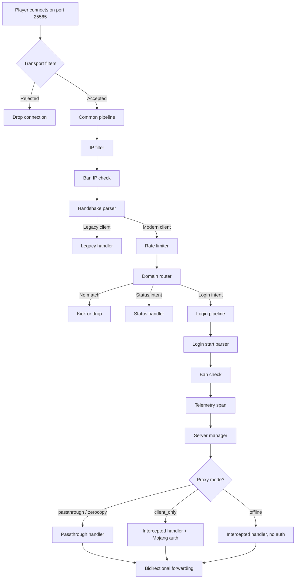

# How It Works

This page walks through what happens inside Infrarust when a Minecraft client connects. Every connection passes through two middleware pipelines, gets routed by domain, and is handed off to a proxy handler that matches the server's configured mode.

## Connection flow

## TCP accept and transport filters

Infrarust binds a TCP listener on the configured address (default `0.0.0.0:25565`). Each accepted connection gets a semaphore permit from the `max_connections` pool. If the pool is exhausted, new connections wait until a slot opens.

Before any packet parsing, plugins can register transport filters that inspect the raw `TransportContext` (remote address, local address, connection time). A filter returning `Reject` drops the connection immediately. This runs before the proxy even reads a byte from the client.

## The common pipeline

Every connection runs through the common pipeline, a sequence of five middlewares executed in order. If any middleware returns `Reject` or `ShortCircuit`, the pipeline stops and no further middlewares run.

### IP filter

Checks the client IP against a global allow/deny list. Blocked IPs never reach the handshake parser.

### Ban IP check

Checks the client IP against the ban system. Unlike the username ban check in the login pipeline, this runs before the handshake is parsed. Banned IPs cannot receive the MOTD or status ping.

### Handshake parser

The first real protocol work. The middleware reads bytes from the TCP stream with a 10-second timeout and attempts to decode them.

The first byte determines the client type:

- `0xFE` indicates a legacy ping (Minecraft Beta through 1.6). The middleware inserts a `LegacyDetected` marker and short-circuits the pipeline. The legacy handler takes over from there.
- `0x02` indicates a legacy login attempt (unsupported, also short-circuits).
- Any other value is treated as a modern Minecraft frame (1.7+).

For modern clients, the middleware decodes the `SHandshake` packet (always packet ID `0x00`). This packet has been stable since Minecraft 1.7, so Infrarust can proxy any protocol version without knowing its specific packet layout.

The handshake contains four fields:

| Field | Type | Purpose |
|-------|------|---------|
| `protocol_version` | VarInt | The client's protocol version number |
| `server_address` | String | The domain the player typed (e.g. `survival.mc.example.com`) |
| `server_port` | u16 | The port number |
| `next_state` | VarInt | 1 = status ping, 2 = login |

The middleware strips Forge Mod Loader markers (`\0FML\0`, `\0FML2\0`, `\0FML3\0`) from the domain, lowercases it, and stores the result as `HandshakeData` in the connection context. The raw packet bytes are preserved for forwarding to the backend later.

### Rate limiter

Applies per-IP rate limits with separate budgets for status pings and login attempts. Uses a token-bucket algorithm. Excess connections get rejected.

### Domain router

Looks up the cleaned domain from the handshake in the `DomainRouter`. This is a thread-safe structure backed by `DashMap` for exact matches and a `RwLock<Vec>` for wildcard patterns.

Resolution order:

1. Exact match via hash map (O(1) lookup)
2. Wildcard patterns scanned sequentially (compiled with `WildMatch` at config load time)

Exact matches always win over wildcards. If no match is found, the connection is rejected or dropped depending on the `unknown_domain_behavior` setting.

On a match, the middleware also checks the server's per-server IP filter. If the client IP is blocked for that specific server, the connection is rejected even though the domain matched.

The result is stored as `RoutingData` containing the matched `ServerConfig` and the config ID.

## Intent branching

After the common pipeline completes, the connection branches on the `next_state` field from the handshake:

**Status** connections go to the status handler, which returns the server list ping response (MOTD, player count, favicon). If the server manager is configured, offline servers show a "starting" message.

**Login** connections continue into the login pipeline.

## The login pipeline

Login connections run through a second pipeline with four middlewares.

### Login start parser

Reads and decodes the `SLoginStart` packet from the client. Extracts the player's username and UUID (UUID is present in protocol versions 1.20.2 and later). The raw packet bytes are appended to `HandshakeData.raw_packets` so the passthrough handler can forward them to the backend as-is.

### Ban check

Checks the player's username and IP against the ban system. This is the full check that catches username-based bans, as opposed to the IP-only check in the common pipeline.

### Telemetry

Creates a tracing span for the session, tagged with the server name, player username, and proxy mode. This span wraps the entire proxy handler execution for distributed tracing.

### Server manager

If the matched server has a `server_manager` configuration, this middleware checks whether the backend is online. If the server is stopped or sleeping, it triggers a wake-up and holds the connection until the server is ready. This is how the "start server on player connect" feature works.

## Proxy handlers

After both pipelines complete, the connection is dispatched to a handler based on the server's `proxy_mode` setting.

### Passthrough handler

Used by both `passthrough` and `zerocopy` modes. The handler:

1. Fires a `ServerPreConnectEvent` through the event bus (plugins can deny or redirect)
2. Connects to the backend server using the addresses from the server config
3. Forwards the raw handshake and login packets to the backend
4. Registers a `PlayerSession` in the connection registry
5. Starts bidirectional forwarding between the client and backend TCP streams

If `domain_rewrite` is configured, the handler re-encodes the handshake packet with the new domain before forwarding. Three rewrite modes exist: `none` (forward as-is), `explicit` (use a fixed string), and `from_backend` (use the backend server's address).

The forwarder is selected based on proxy mode. On Linux with `zerocopy` mode, Infrarust uses `splice(2)` for kernel-level data transfer without copying bytes into userspace. All other modes use `tokio::io::copy_bidirectional`.

When either side closes the connection, the handler unregisters the session and fires a `DisconnectEvent`.

### Intercepted handler (client_only and offline)

The intercepted handler fully terminates the Minecraft protocol on the proxy side. Instead of forwarding raw bytes, it creates a `ClientBridge` that speaks the Minecraft protocol to the player.

In `client_only` mode, the handler performs Mojang authentication: it sends an encryption request to the client, verifies the shared secret with Mojang's session server, and enables encrypted communication. The backend server runs with `online-mode=false` since the proxy already verified the player's identity.

In `offline` mode, no authentication happens. The proxy accepts whatever username the client provides.

After authentication, the handler resolves the initial connection mode. If the backend is reachable, it connects and starts a session loop that reads packets from both the client and the backend, passing them through codec filter chains registered by plugins. If the backend is unavailable and a limbo handler is registered, the player enters limbo (a virtual world hosted by the proxy itself) until the backend comes online.

The session loop also supports server switching: a plugin can instruct the proxy to move a player to a different backend without disconnecting them from the proxy.

## The connection context

Data flows between middlewares through the `ConnectionContext`, which carries fixed fields (peer address, client IP, the TCP stream) and a type-erased `Extensions` map. Each middleware reads what it needs from extensions inserted by previous middlewares and inserts its own data for downstream consumers.

The key extension types in order:

| Type | Inserted by | Contains |
|------|------------|----------|
| `LegacyDetected` | Handshake parser | Marker for pre-1.7 clients |
| `HandshakeData` | Handshake parser | Domain, port, protocol version, intent, raw bytes |
| `RoutingData` | Domain router | Matched server config and config ID |
| `LoginData` | Login start parser | Username and optional UUID |
| `ConnectionSpan` | Telemetry middleware | Tracing span for the session |

This design keeps middlewares decoupled. The domain router does not know about the handshake parser's internals; it just reads `HandshakeData` from the extensions map. If a middleware is removed from the pipeline, only the middlewares that depend on its output need adjustment.
